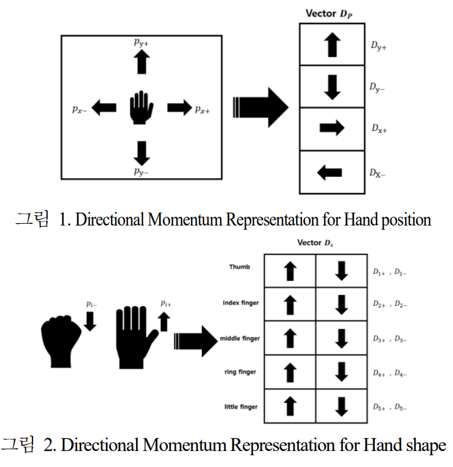
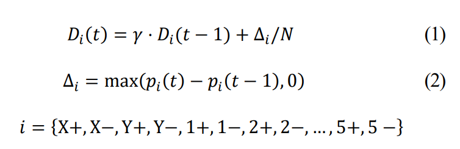
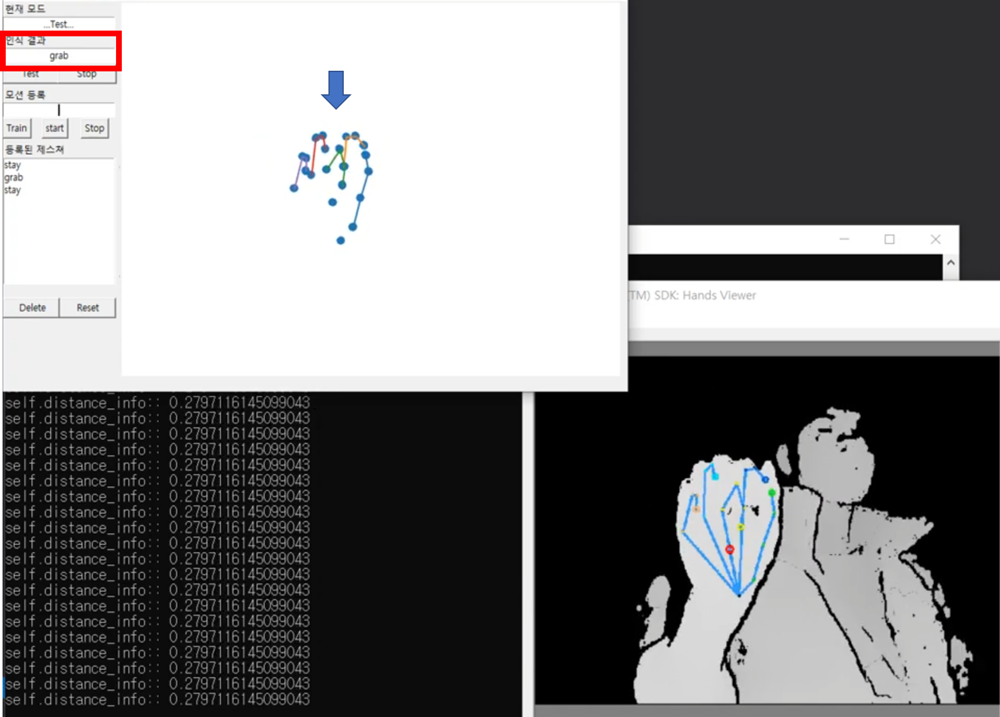
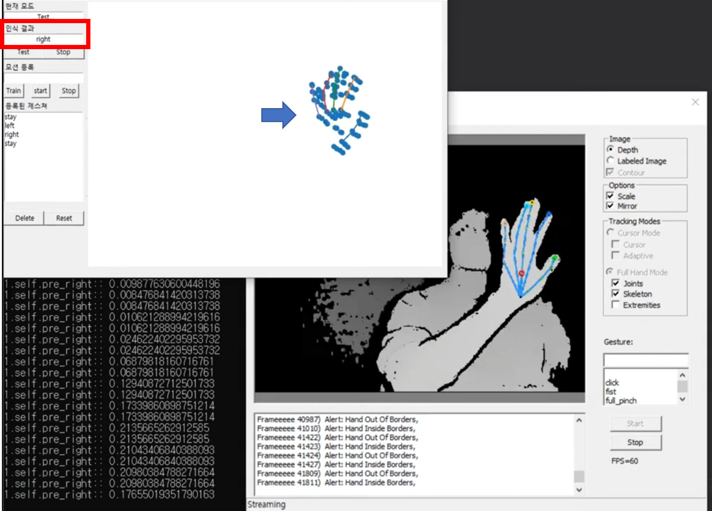

# Fuzzy ARTMAP 을 이용한  Dynamic Hand Gesture 실시간 학습 및 인식
# HGU CSEE project 316
```The all materials are provided in Korean```

## Abstract
Previously proposed models for time series data such as RNN and LSTM have limitations in learning
new categories in real time. This paper uses Fuzzy ARTMAP, which enables a model to quickly learn new
categories with a small amount of computation time. In addition, This paper proposes a method for converting
static hand joint data into dynamic information for learning and classifying dynamic hand gestures

[Paper](https://github.com/rlgnswk/project_316/blob/master/Paper/(Korean)Fuzzy%20ARTMAP%EC%9D%84_%EC%9D%B4%EC%9A%A9%ED%95%9C_Dynamic_Hand_Gesture_%EC%8B%A4%EC%8B%9C%EA%B0%84_%ED%95%99%EC%8A%B5_%EB%B0%8F_%EC%9D%B8%EC%8B%9D.pdf) ([ICROS 2020](http://2020.icros.org/?page_id=61), Best undergraduate paper)

[Presentation](https://www.youtube.com/watch?v=3Ba6yfdvaHw)

## Method

<p float="center">
  
   
</p>

## Results(Hand shape)
You can find the test video(Hand shape) from [Here](https://www.youtube.com/watch?v=H2nVC2lFWjI)




## Results(Hand Position)
You can find the test video(Hand Position) from [Here](https://www.youtube.com/watch?v=nz32D1FPceo)



## Fuzzy ARTAMP Tuturial
You can learn the process of Fuzzy ARTAMP algorithm from [Fuzzy ARTAMP Tuturial](https://github.com/rlgnswk/project_316/blob/master/ARTMAP%20Test%20Code.ipynb)

# Comment

Fuzzy ARTMAP을 이용한 Dynamic Hand Gesture 실시간 학습 및 인식

-class_ARTAMP.py

-class_GUI_dynamic.py

-class_server.py

-main.py

(카메라 센서 코드는 업로드 하지 않음)

실시간 손 동작 학습 및 인식을 위한 코드

교수님 지도에 항상 감사하고 있습니다.
